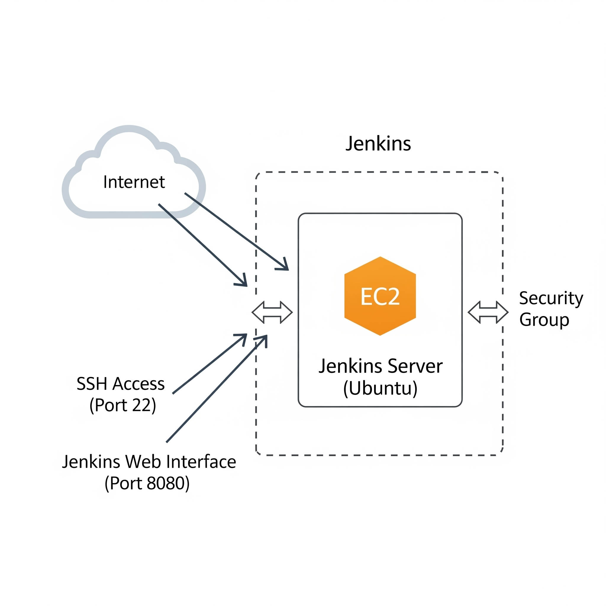
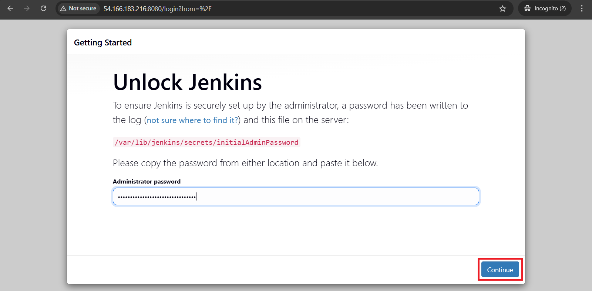
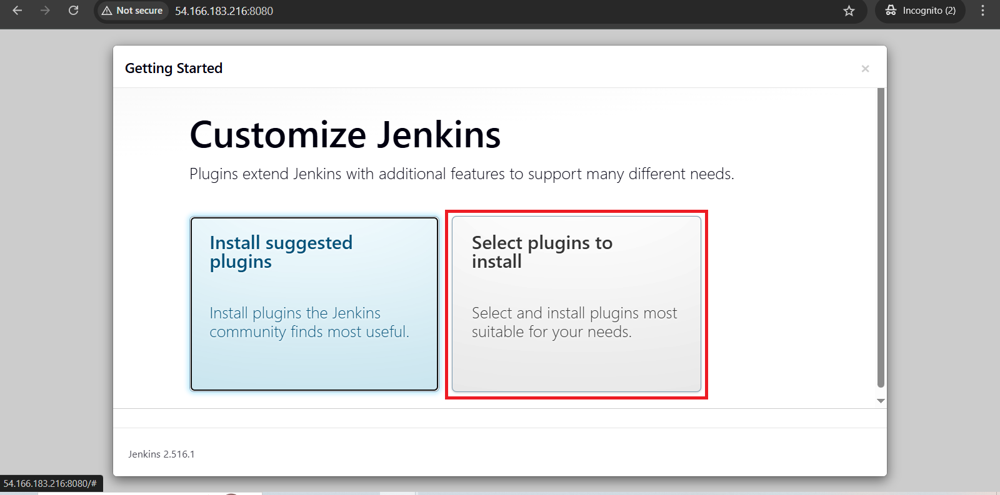
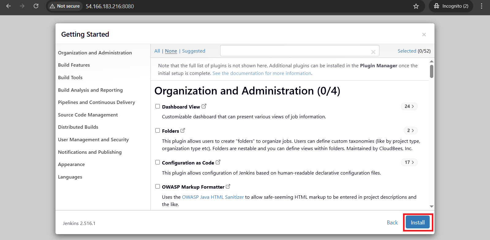
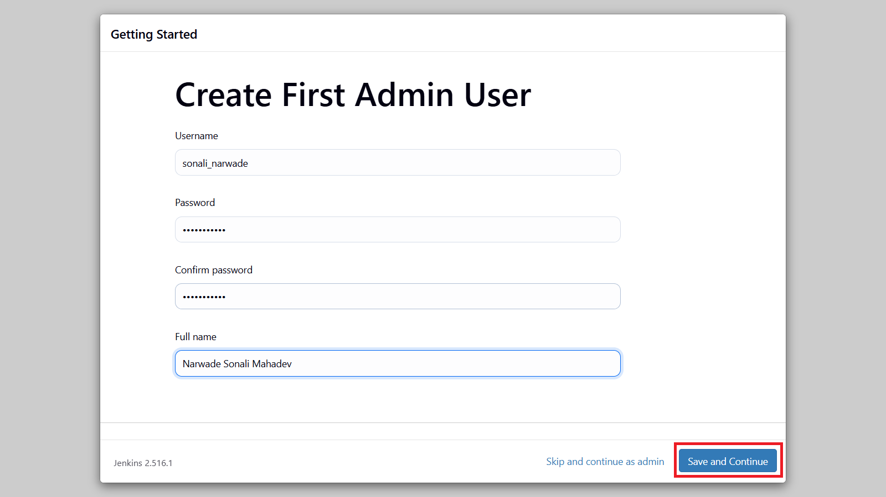
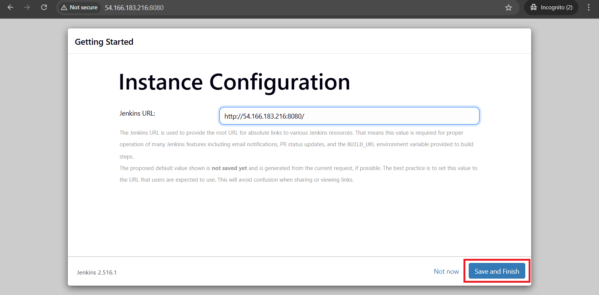
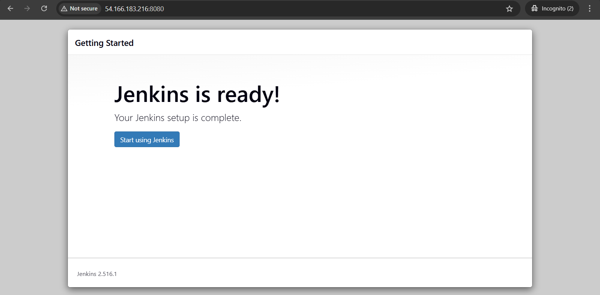
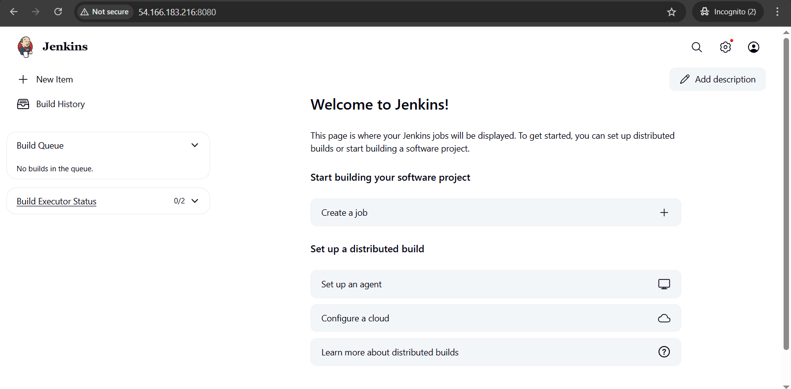

# 🚀 Jenkins Server Deployment on AWS EC2 (Ubuntu) – Complete Installation Setup Guide

This comprehensive guide walks you through every step needed to deploy and set up Jenkins on an Ubuntu-based EC2 instance using AWS. 

Jenkins is a powerful open-source automation server that enables continuous integration and continuous delivery (CI/CD) of software projects. By the end of this guide, you’ll have a fully functional Jenkins server ready for building and deploying applications.

---


## Architecture Overview
The Jenkins server is deployed on an AWS EC2 instance running Ubuntu. Here's how the architecture is laid out:



---

# Prerequisites

- Before starting Jenkins installation, make sure your system meets the following requirements:

- Minimum RAM: 256 MB (Jenkins will run better with at least 1 GB)

- Disk Space: At least 1 GB available

- Operating System: Ubuntu (recommended), Windows, or Linux

- Java: Required for Jenkins to run

---

## Software Requirements

- The Jenkins server depends on several software components to operate properly:

- Java: Jenkins is written in Java, and the Java Development Kit (JDK) is required to run it

- Supported operating systems include:

- Ubuntu
---

## Step 1: Launch EC2 Instance

This step involves setting up a virtual machine in AWS that will host Jenkins.

- Instance Name: Choose a meaningful name, like jenkin-server, to easily identify your instance.

- Select AMI: Select the Ubuntu Server LTS version (latest available) as the Amazon Machine Image. 

Jenkins works best on Ubuntu due to easy package management and community support.

- Instance Type: Choose t2.micro if you're eligible for the AWS free tier. This instance type includes 1 vCPU and 1 GB of memory, which is sufficient for basic Jenkins tasks.

- Key Pair: Use an existing key pair or generate a new one (e.g., pem-server-key.pem) to enable secure SSH access to your server. Download and store this .pem file securely.

- Security Group: Configure a security group to allow traffic:

- Port 22 (SSH): For connecting to your instance.

- Port 8080 (Jenkins): Jenkins runs on this port.

- Optional - Port 80 or 443: For redirecting to HTTP/HTTPS if needed later.

- Once the instance is launched, copy its public IPv4 address—you'll use this to access Jenkins in your browser later.

---
## Step 2: Install Java
Java is essential for Jenkins to run.
We will install OpenJDK 17, which is officially supported by Jenkins.

Update system packages and install Java:
```
sudo apt update && sudo apt upgrade -y
sudo apt install openjdk-17-jdk -y

```
Verify Java installation:
```
java -version
```
Expected output should display openjdk version "17...".

---
## Step 3: Install Jenkins
We will now install Jenkins from the official package repository.
### Add Jenkins GPG Key and Repository
Create a keyring directory and download Jenkins’ public signing key:

```
sudo mkdir -p /etc/apt/keyrings
sudo wget -O /etc/apt/keyrings/jenkins-keyring.asc \
https://pkg.jenkins.io/debian-stable/jenkins.io-2023.key

```
Add the Jenkins repository:
```
echo "deb [signed-by=/etc/apt/keyrings/jenkins-keyring.asc] \
https://pkg.jenkins.io/debian-stable binary/" | \
sudo tee /etc/apt/sources.list.d/jenkins.list > /dev/null
```
### Update Package Index and Install Jenkins
```
sudo apt-get update
sudo apt-get install jenkins -y

```
This installs the Jenkins service and all necessary dependencies.

---
## Step 4: Enable and Start Jenkins
Use the following commands to start Jenkins and enable it to start automatically at boot:
```
sudo systemctl enable jenkins
sudo systemctl start jenkins
```
Check the status of the Jenkins service:
```
sudo systemctl status jenkins

```
You should see that Jenkins is active (running).

---
## Step 5: Access Jenkins Web Interface



Once Jenkins is running, open your web browser and go to:
```
http://54.166.183.216:8080/
```
Replace 54.166.183.216:8080 with your EC2 instance’s actual public IP address.
Example:
```
http://54.166.183.216:8080

```
You’ll be presented with the Jenkins unlock screen.

---
## Step 6: Setup Jenkins
### Retrieve Initial Admin Password


Run this command to retrieve the password Jenkins generated during installation :
```
sudo cat /var/lib/jenkins/secrets/initialAdminPassword

```
- Copy the output and paste it into the Jenkins setup page in your browser.

- Click Continue to proceed.



## Install Plugins
- Choose Install suggested plugins for a quick start.



- Alternatively, select specific plugins to match your project needs.



---

## Create Your First Admin User
Fill out the admin user setup form:

- Username:sonali_narwade

- Password: sonali@7498

- Full Name: Narwade SOnali

- Email Address: narwadesonali7@gmail.com

Click Save and Continue to proceed.

Jenkins will finalize setup and direct you to the dashboard.

- Click on Save and finish



---



## Final Step: Jenkins Dashboard



You have successfully installed and configured Jenkins!

- From the dashboard, you can:

- Create and manage jobs

- Install and manage plugins

- Configure build pipelines

- Integrate GitHub, Docker, and other DevOps tools

Start exploring and automating your CI/CD workflows.

---

## Conclusion :
Congratulations!  You’ve successfully installed and configured Jenkins on your Ubuntu EC2 instance. Your Jenkins server is now up and running on port 8080, accessible through your public IP address. From here, you can start creating pipelines, integrate with version control systems like GitHub or GitLab, and automate your CI/CD processes with ease.

This setup lays the foundation for powerful automation workflows that can streamline development, testing, and deployment in any project.

If you face any issues, refer to Jenkins documentation or revisit each step for troubleshooting.

#### Happy Automating with Jenkins! 🚀


